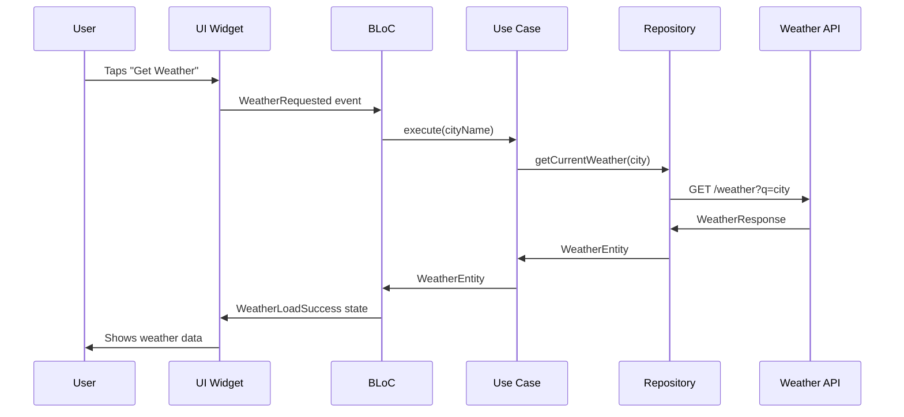

# 🏗️ Architecture Guide - Project Weather App

## 📖 Tổng quan

Project Weather được xây dựng theo nguyên tắc **Clean Architecture** của Uncle Bob, đảm bảo tách biệt rõ ràng giữa các layer và giúp code dễ maintain, test và scale.

## 🎯 Nguyên tắc Clean Architecture

### 1. **Dependency Rule**
```
📁 Dependency Flow
🔵 Presentation Layer
    ↓ (depends on)
🟡 Domain Layer  
    ↑ (implemented by)
🟢 Data Layer
```

- **Inner layers** không biết về **outer layers**
- **Dependencies** chỉ point inward
- **Business logic** tách biệt hoàn toàn khỏi framework

### 2. **Layer Responsibilities**

#### 🔵 Presentation Layer (`app/`)
- **UI Components**: Widgets, Screens, Navigation
- **State Management**: BLoC pattern implementation  
- **User Interaction**: Event handling, input validation
- **Framework Specific**: Flutter-specific code

#### 🟡 Domain Layer (`domain/`)
- **Business Logic**: Use cases, business rules
- **Entities**: Core data models
- **Repository Interfaces**: Abstract data access
- **Framework Independent**: Pure Dart code

#### 🟢 Data Layer (`data/`)
- **Data Sources**: API clients, databases, cache
- **Repository Implementation**: Concrete data access
- **Data Models**: API response models, DTOs
- **Data Mapping**: Convert external data to domain entities

#### ⚪ Shared Layer (`shared/`)
- **Common Utilities**: String, Date, Validation helpers
- **Extensions**: Dart/Flutter extensions  
- **Constants**: App-wide constants
- **Pure Functions**: No business logic dependencies

## 📦 Package Structure

```
project_weather/
├── 📱 app/                 # Presentation Layer
│   ├── lib/
│   │   ├── main.dart       # App entry point
│   │   ├── ui/             # Screens & Widgets
│   │   │   ├── weather/    # Weather screens
│   │   │   ├── location/   # Location screens
│   │   │   └── shared/     # Shared UI components
│   │   ├── bloc/           # State management
│   │   ├── navigation/     # Route configuration
│   │   └── di/             # Dependency injection
│   └── test/               # Presentation tests
│
├── 🧠 domain/              # Business Logic Layer
│   ├── lib/
│   │   ├── entity/         # Core business models
│   │   │   ├── weather.dart
│   │   │   └── location.dart
│   │   ├── usecase/        # Business use cases
│   │   │   ├── get_current_weather.dart
│   │   │   └── get_forecast.dart
│   │   └── repository/     # Repository interfaces
│   │       └── weather_repository.dart
│   └── test/               # Business logic tests
│
├── 🗄️ data/               # Data Access Layer
│   ├── lib/
│   │   ├── source/         # Data sources
│   │   │   ├── remote/     # API implementation
│   │   │   └── local/      # Local storage
│   │   ├── model/          # Data models (DTOs)
│   │   ├── mapper/         # Data to Domain mapping
│   │   └── repository/     # Repository implementations
│   └── test/               # Data layer tests
│
├── 🔧 shared/              # Common Utilities
│   ├── lib/
│   │   ├── utils/          # Utility functions
│   │   ├── extensions/     # Dart extensions
│   │   ├── constants/      # App constants
│   │   └── exceptions/     # Error handling
│   └── test/               # Utility tests
│
├── 🎨 resources/           # Assets & Resources
│   ├── lib/
│   │   ├── assets/         # Generated asset classes
│   │   ├── fonts/          # Typography
│   │   └── l10n/           # Localization
│   └── assets/             # Static assets
│
├── 🚀 initializer/         # App Initialization
│   ├── lib/
│   │   ├── config/         # App configuration
│   │   ├── di/             # Dependency setup
│   │   └── services/       # Service initialization
│   └── test/               # Initialization tests
│
└── 🔍 nals_lints/          # Code Quality
    ├── lib/
    │   └── src/            # Custom lint rules
    └── test/               # Lint rule tests
```

## 🔄 Data Flow

### 1. **Typical User Interaction Flow**



### 2. **Dependency Injection Flow**

```dart
// 🔧 Initializer registers dependencies
@module
abstract class DataModule {
  @singleton
  WeatherApiService weatherApiService() => WeatherApiService();
  
  @singleton 
  WeatherRepository weatherRepository(WeatherApiService api) 
    => WeatherRepositoryImpl(api);
}

// 🧠 Domain defines interfaces
abstract class WeatherRepository {
  Future<WeatherEntity> getCurrentWeather(String city);
}

// 🗄️ Data implements interfaces  
class WeatherRepositoryImpl implements WeatherRepository {
  final WeatherApiService _apiService;
  
  WeatherRepositoryImpl(this._apiService);
  
  @override
  Future<WeatherEntity> getCurrentWeather(String city) async {
    final response = await _apiService.getCurrentWeather(city);
    return WeatherMapper.toEntity(response);
  }
}

// 📱 Presentation consumes via BLoC
class WeatherBloc extends Bloc<WeatherEvent, WeatherState> {
  final GetCurrentWeatherUseCase _getCurrentWeather;
  
  WeatherBloc(this._getCurrentWeather);
  
  @override
  Stream<WeatherState> mapEventToState(WeatherEvent event) async* {
    if (event is WeatherRequested) {
      final weather = await _getCurrentWeather.execute(event.city);
      yield WeatherLoadSuccess(weather);
    }
  }
}
```

## 🧪 Testing Strategy per Layer

### 🔵 Presentation Layer Testing

```dart
// Widget Testing
testWidgets('should display weather data when loaded', (tester) async {
  // Arrange
  when(() => mockBloc.state).thenReturn(WeatherLoadSuccess(mockWeather));
  
  // Act
  await tester.pumpWidget(createTestableWidget(WeatherPage()));
  
  // Assert
  expect(find.text('25°C'), findsOneWidget);
  expect(find.text('Sunny'), findsOneWidget);
});

// BLoC Testing
blocTest<WeatherBloc, WeatherState>(
  'emits [loading, success] when weather is fetched',
  build: () {
    when(() => mockGetWeather.execute(any()))
        .thenAnswer((_) async => mockWeatherEntity);
    return weatherBloc;
  },
  act: (bloc) => bloc.add(WeatherRequested('London')),
  expect: () => [
    WeatherLoading(),
    WeatherLoadSuccess(mockWeatherEntity),
  ],
);
```

### 🟡 Domain Layer Testing

```dart
// Use Case Testing
test('should return weather entity when repository call is successful', () async {
  // Arrange
  when(() => mockRepository.getCurrentWeather(any()))
      .thenAnswer((_) async => mockWeatherEntity);
  
  // Act  
  final result = await useCase.execute('London');
  
  // Assert
  expect(result, equals(mockWeatherEntity));
  verify(() => mockRepository.getCurrentWeather('London')).called(1);
});
```

### 🟢 Data Layer Testing

```dart
// Repository Testing
test('should return weather entity when API call is successful', () async {
  // Arrange
  when(() => mockApiService.getCurrentWeather(any()))
      .thenAnswer((_) async => mockWeatherResponse);
  
  // Act
  final result = await repository.getCurrentWeather('London');
  
  // Assert
  expect(result, isA<WeatherEntity>());
  expect(result.temperature, equals(25.0));
});

// Mapper Testing  
test('should correctly map API response to domain entity', () {
  // Arrange
  final apiResponse = WeatherResponse(
    temperature: 25.0,
    description: 'sunny',
    humidity: 60,
  );
  
  // Act
  final entity = WeatherMapper.toEntity(apiResponse);
  
  // Assert
  expect(entity.temperature, equals(25.0));
  expect(entity.condition, equals(WeatherCondition.sunny));
});
```

## 🎛️ State Management Pattern

### BLoC Architecture

```dart
// 📱 Events (User Intentions)
abstract class WeatherEvent {}

class WeatherRequested extends WeatherEvent {
  final String city;
  WeatherRequested(this.city);
}

class WeatherRefreshRequested extends WeatherEvent {}

// 📱 States (UI States)  
abstract class WeatherState {}

class WeatherInitial extends WeatherState {}
class WeatherLoading extends WeatherState {}
class WeatherLoadSuccess extends WeatherState {
  final WeatherEntity weather;
  WeatherLoadSuccess(this.weather);
}
class WeatherLoadFailure extends WeatherState {
  final String error;
  WeatherLoadFailure(this.error);
}

// 📱 BLoC (Business Logic Component)
class WeatherBloc extends Bloc<WeatherEvent, WeatherState> {
  final GetCurrentWeatherUseCase _getCurrentWeather;
  final GetWeatherForecastUseCase _getForecast;
  
  WeatherBloc(this._getCurrentWeather, this._getForecast)
      : super(WeatherInitial());
  
  @override
  Stream<WeatherState> mapEventToState(WeatherEvent event) async* {
    if (event is WeatherRequested) {
      yield* _mapWeatherRequestedToState(event);
    }
  }
  
  Stream<WeatherState> _mapWeatherRequestedToState(
    WeatherRequested event,
  ) async* {
    yield WeatherLoading();
    
    try {
      final weather = await _getCurrentWeather.execute(event.city);
      yield WeatherLoadSuccess(weather);
    } catch (error) {
      yield WeatherLoadFailure(error.toString());
    }
  }
}
```

## 🔌 Dependency Injection Pattern

### Service Locator with Injectable

```dart
// 🔧 Injectable Configuration
@InjectableInit(
  initializerName: 'init',
  preferRelativeImports: true,
  asExtension: true,
)
void configureDependencies() => getIt.init();

// 🧠 Domain Registration
@module
abstract class DomainModule {
  @singleton
  GetCurrentWeatherUseCase getCurrentWeatherUseCase(
    WeatherRepository repository,
  ) => GetCurrentWeatherUseCase(repository);
}

// 🗄️ Data Registration  
@module
abstract class DataModule {
  @singleton
  WeatherApiService weatherApiService() => WeatherApiService();
  
  @singleton
  @Named('weather-cache')
  CacheManager cacheManager() => CacheManager(
    Config('weather-cache', maxNrOfCacheObjects: 100),
  );
  
  @singleton
  WeatherRepository weatherRepository(
    WeatherApiService apiService,
    @Named('weather-cache') CacheManager cache,
  ) => WeatherRepositoryImpl(apiService, cache);
}

// 📱 Presentation Registration
@module  
abstract class PresentationModule {
  @singleton
  WeatherBloc weatherBloc(
    GetCurrentWeatherUseCase getCurrentWeather,
    GetWeatherForecastUseCase getForecast,
  ) => WeatherBloc(getCurrentWeather, getForecast);
}
```

## 🌐 API Integration Pattern

### Repository Pattern Implementation

```dart
// 🧠 Domain Interface
abstract class WeatherRepository {
  Future<WeatherEntity> getCurrentWeather(String city);
  Future<List<ForecastEntity>> getWeatherForecast(String city);
  Future<void> refreshWeatherData(String city);
}

// 🗄️ Data Implementation
@Singleton(as: WeatherRepository)
class WeatherRepositoryImpl implements WeatherRepository {
  final WeatherApiService _apiService;
  final CacheManager _cache;
  final NetworkInfo _networkInfo;
  
  WeatherRepositoryImpl(this._apiService, this._cache, this._networkInfo);
  
  @override
  Future<WeatherEntity> getCurrentWeather(String city) async {
    if (await _networkInfo.isConnected) {
      return _getWeatherFromRemote(city);
    } else {
      return _getWeatherFromCache(city);
    }
  }
  
  Future<WeatherEntity> _getWeatherFromRemote(String city) async {
    try {
      final response = await _apiService.getCurrentWeather(city);
      await _cacheWeatherData(city, response);
      return WeatherMapper.toEntity(response);
    } catch (error) {
      // Fallback to cache if available
      return _getWeatherFromCache(city);
    }
  }
  
  Future<WeatherEntity> _getWeatherFromCache(String city) async {
    final cachedData = await _cache.getFileFromCache('weather_$city');
    if (cachedData != null) {
      final response = WeatherResponse.fromJson(
        json.decode(await cachedData.file.readAsString()),
      );
      return WeatherMapper.toEntity(response);
    }
    throw CacheException('No cached data available');
  }
}
```

## 🔧 Error Handling Strategy

### Centralized Exception Handling

```dart
// 🔧 Shared Exception Types
abstract class AppException implements Exception {
  final String message;
  final String? code;
  
  const AppException(this.message, [this.code]);
}

class NetworkException extends AppException {
  const NetworkException(String message) : super(message, 'NETWORK_ERROR');
}

class ApiException extends AppException {
  final int statusCode;
  
  const ApiException(String message, this.statusCode) 
      : super(message, 'API_ERROR');
}

class CacheException extends AppException {
  const CacheException(String message) : super(message, 'CACHE_ERROR');
}

// 📱 Exception Handler
class ExceptionHandler {
  static String mapExceptionToMessage(Exception exception) {
    if (exception is NetworkException) {
      return 'Check your internet connection';
    } else if (exception is ApiException) {
      return 'Server error occurred';
    } else if (exception is CacheException) {
      return 'Data not available offline';
    } else {
      return 'An unexpected error occurred';
    }
  }
}

// 📱 BLoC Error Handling
Stream<WeatherState> _mapWeatherRequestedToState(
  WeatherRequested event,
) async* {
  yield WeatherLoading();
  
  try {
    final weather = await _getCurrentWeather.execute(event.city);
    yield WeatherLoadSuccess(weather);
  } on NetworkException catch (e) {
    yield WeatherLoadFailure('Network error: ${e.message}');
  } on ApiException catch (e) {
    yield WeatherLoadFailure('API error: ${e.message}');
  } catch (e) {
    yield WeatherLoadFailure('Unexpected error: ${e.toString()}');
  }
}
```

## 📊 Performance Considerations

### 1. **Caching Strategy**
```dart
// Multi-level caching
class WeatherRepositoryImpl {
  // Memory cache (fastest)
  final Map<String, WeatherEntity> _memoryCache = {};
  
  // Disk cache (persistent)  
  final CacheManager _diskCache;
  
  // Network (slowest, most up-to-date)
  final WeatherApiService _apiService;
  
  Future<WeatherEntity> getCurrentWeather(String city) async {
    // 1. Check memory cache
    if (_memoryCache.containsKey(city)) {
      return _memoryCache[city]!;
    }
    
    // 2. Check disk cache
    try {
      final cached = await _getFromDiskCache(city);
      _memoryCache[city] = cached;
      return cached;
    } catch (e) {
      // 3. Fetch from network
      final weather = await _fetchFromNetwork(city);
      _memoryCache[city] = weather;
      await _saveToDiskCache(city, weather);
      return weather;
    }
  }
}
```

### 2. **Code Generation Optimization**
```bash
# Build runner for code generation
flutter packages pub run build_runner build

# Generated files (not committed to git):
# - *.g.dart (JSON serialization)
# - *.freezed.dart (Data classes)
# - *.config.dart (Injectable DI)
```

### 3. **Bundle Size Optimization**
```yaml
# pubspec.yaml - Tree shaking friendly
dependencies:
  # Use specific imports
  http: ^1.1.0        # Instead of dio for simple use cases
  
  # Platform-specific dependencies
  geolocator: 
    version: ^10.1.0
    # Only include what you need
    platforms:
      - android
      - ios
```

## 🏆 Best Practices

### 1. **Layer Communication**
```dart
// ✅ Correct: Use abstractions
class GetWeatherUseCase {
  final WeatherRepository _repository; // Interface, not implementation
  
  GetWeatherUseCase(this._repository);
}

// ❌ Wrong: Direct dependency on outer layer
class GetWeatherUseCase {
  final WeatherApiService _apiService; // Skip repository layer
}
```

### 2. **Entity vs Model Separation**
```dart
// 🧠 Domain Entity (Business focused)
class WeatherEntity {
  final double temperature;
  final WeatherCondition condition;
  final DateTime timestamp;
  
  // Business methods
  bool get isComfortable => temperature >= 18 && temperature <= 26;
  String get displayTemperature => '${temperature.round()}°C';
}

// 🗄️ Data Model (API focused)
@JsonSerializable()
class WeatherResponse {
  @JsonKey(name: 'temp')
  final double temperature;
  
  @JsonKey(name: 'weather_main')
  final String weatherMain;
  
  @JsonKey(name: 'dt')
  final int unixTimestamp;
  
  // Only JSON serialization, no business logic
}
```

### 3. **State Management Best Practices**
```dart
// ✅ Immutable states
@freezed
class WeatherState with _$WeatherState {
  const factory WeatherState.initial() = WeatherInitial;
  const factory WeatherState.loading() = WeatherLoading;
  const factory WeatherState.success(WeatherEntity weather) = WeatherSuccess;
  const factory WeatherState.failure(String message) = WeatherFailure;
}

// ✅ Event-driven architecture
abstract class WeatherEvent {}

class WeatherRequested extends WeatherEvent {
  final String city;
  WeatherRequested(this.city);
}
```

## 📚 Tài liệu tham khảo

- **Clean Architecture**: [Robert Martin - Clean Architecture](https://blog.cleancoder.com/uncle-bob/2012/08/13/the-clean-architecture.html)
- **BLoC Pattern**: [Flutter BLoC Library](https://bloclibrary.dev/#/architecture)
- **Dependency Injection**: [Injectable Package](https://pub.dev/packages/injectable)
- **Testing**: [Flutter Testing Guide](https://docs.flutter.dev/testing)
- **Code Generation**: [Build Runner](https://pub.dev/packages/build_runner)

---

**Architecture này đảm bảo code base:**
- 🔧 **Maintainable** - Dễ maintain và extend
- 🧪 **Testable** - Easy to unit test mỗi layer
- 🔄 **Scalable** - Dễ thêm features mới
- 🏗️ **Flexible** - Dễ thay đổi implementation
- 📱 **Platform Independent** - Business logic tách biệt khỏi Flutter
