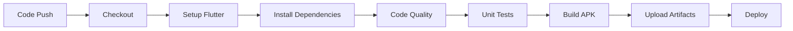

# 🚀 Deployment Guide - Project Weather App

## 📖 Tổng quan

Tài liệu này hướng dẫn chi tiết về quy trình deployment, CI/CD pipeline, và cấu hình environments cho ứng dụng Weather App.

## 🏗️ Build Configurations

### Environment Flavors

Project hỗ trợ 3 môi trường:

```
📱 Environments
├── 🧪 develop   - Development/Testing
├── 🔄 staging   - Pre-production 
└── 🚀 production - Live production
```

### Flavor Configuration

```dart
// lib/flavor/flavor_config.dart
enum Flavor { develop, staging, production }

class FlavorConfig {
  static Flavor appFlavor = Flavor.develop;
  
  static String get apiBaseUrl {
    switch (appFlavor) {
      case Flavor.develop:
        return 'https://api.openweathermap.org/data/2.5';
      case Flavor.staging:
        return 'https://staging-api.openweathermap.org/data/2.5';
      case Flavor.production:
        return 'https://api.openweathermap.org/data/2.5';
    }
  }
}
```

## 🔧 Build Commands

### Local Development

```bash
# Build develop APK
flutter build apk --flavor develop --debug
flutter build apk --flavor develop --release

# Build iOS
flutter build ios --flavor develop --debug
flutter build ios --flavor develop --release

# Install develop flavor
flutter install --flavor develop
```

### Using Melos

```bash
# Build all packages
melos run build

# Build specific platform
melos run build:android
melos run build:ios

# Build with specific flavor
melos run build:develop
melos run build:staging
melos run build:production
```

## 🔄 CI/CD Pipeline

### GitHub Actions Workflow

```yaml
# .github/workflows/ci.yml
name: CI/CD Pipeline

on:
  push:
    branches: [master, develop]
  pull_request:
    branches: [master, develop]

jobs:
  test:
    runs-on: ubuntu-latest
    steps:
      - name: Checkout
        uses: actions/checkout@v4
      
      - name: Setup Flutter
        uses: subosito/flutter-action@v2
        with:
          flutter-version: '3.29.3'
      
      - name: Install Dependencies
        run: |
          dart pub global activate melos 4.1.0
          make sync
      
      - name: Code Quality Checks
        run: |
          make format
          make analyze
          make test
          make dart_code_metrics
      
      - name: Build Develop APK
        if: github.ref == 'refs/heads/develop'
        run: |
          cd app
          flutter build apk --flavor develop --release
      
      - name: Build Production APK
        if: github.ref == 'refs/heads/master'
        run: |
          cd app
          flutter build apk --flavor production --release
      
      - name: Upload Artifacts
        uses: actions/upload-artifact@v4
        with:
          name: app-release-apk
          path: app/build/app/outputs/flutter-apk/
```

### Pipeline Stages



## 📱 Platform-specific Setup

### Android Configuration

#### Flavor Setup

```gradle
// android/app/build.gradle
android {
    flavorDimensions "default"
    
    productFlavors {
        develop {
            dimension "default"
            applicationIdSuffix ".dev"
            versionNameSuffix "-dev"
            resValue "string", "app_name", "Weather Dev"
        }
        
        staging {
            dimension "default"
            applicationIdSuffix ".staging"
            versionNameSuffix "-staging"
            resValue "string", "app_name", "Weather Staging"
        }
        
        production {
            dimension "default"
            resValue "string", "app_name", "Weather"
        }
    }
}
```

#### Signing Configuration

```gradle
// android/app/build.gradle
android {
    signingConfigs {
        release {
            keyAlias keystoreProperties['keyAlias']
            keyPassword keystoreProperties['keyPassword']
            storeFile file(keystoreProperties['storeFile'])
            storePassword keystoreProperties['storePassword']
        }
    }
    
    buildTypes {
        release {
            signingConfig signingConfigs.release
            minifyEnabled true
            proguardFiles getDefaultProguardFile('proguard-android.txt'), 'proguard-rules.pro'
        }
    }
}
```

#### ProGuard Rules

```proguard
# android/app/proguard-rules.pro
-keep class io.flutter.app.** { *; }
-keep class io.flutter.plugin.** { *; }
-keep class io.flutter.util.** { *; }
-keep class io.flutter.view.** { *; }
-keep class io.flutter.** { *; }
-keep class io.flutter.plugins.** { *; }

# Weather API models
-keep class com.weather.data.models.** { *; }
-keepclassmembers class com.weather.data.models.** { *; }
```

### iOS Configuration

#### Scheme Setup

```ruby
# ios/Runner.xcodeproj/xcschemes/
├── Runner-develop.xcscheme
├── Runner-staging.xcscheme  
└── Runner-production.xcscheme
```

#### Info.plist Configuration

```xml
<!-- ios/Runner/Info.plist -->
<dict>
    <key>CFBundleDisplayName</key>
    <string>$(APP_DISPLAY_NAME)</string>
    
    <key>CFBundleIdentifier</key>
    <string>$(PRODUCT_BUNDLE_IDENTIFIER)</string>
    
    <key>NSLocationWhenInUseUsageDescription</key>
    <string>This app needs location access to show weather for your current location.</string>
</dict>
```

## 🌐 Environment Variables

### API Configuration

```bash
# .env.develop
API_BASE_URL=https://api.openweathermap.org/data/2.5
API_KEY=your_develop_api_key
APP_NAME=Weather Dev
ENVIRONMENT=develop

# .env.production  
API_BASE_URL=https://api.openweathermap.org/data/2.5
API_KEY=your_production_api_key
APP_NAME=Weather
ENVIRONMENT=production
```

### Environment Loading

```dart
// lib/env/env_config.dart
@EnviedConfig(path: '.env')
abstract class EnvConfig {
  @EnviedField(varName: 'API_KEY')
  static const String apiKey = _EnvConfig.apiKey;
  
  @EnviedField(varName: 'API_BASE_URL')
  static const String apiBaseUrl = _EnvConfig.apiBaseUrl;
  
  @EnviedField(varName: 'ENVIRONMENT')
  static const String environment = _EnvConfig.environment;
}
```

## 📦 Release Management

### Version Bumping

```bash
# Bump version automatically
melos version

# Manual version bump
melos version --graduate

# Update specific package
melos version --scope=app
```

### Release Checklist

#### Pre-release

- [ ] **Code review** completed
- [ ] **All tests** passing
- [ ] **Performance** metrics checked
- [ ] **Security** scan completed
- [ ] **API keys** configured
- [ ] **Flavor** configuration verified

#### Release Process

```bash
# 1. Checkout release branch
git checkout -b release/v1.0.0

# 2. Update version
melos version

# 3. Generate changelog
melos exec -- dart pub run build_runner build

# 4. Run full test suite
make test_all

# 5. Build release APK
flutter build apk --flavor production --release

# 6. Create GitHub release
gh release create v1.0.0 \
  --title "Weather App v1.0.0" \
  --notes-file CHANGELOG.md \
  app/build/app/outputs/flutter-apk/app-production-release.apk
```

## 🏪 Store Deployment

### Google Play Store

#### Upload Steps

1. **Build release APK**:
```bash
flutter build appbundle --flavor production --release
```

2. **Upload to Play Console**:
   - Internal testing → Alpha → Beta → Production
   - Fill store listing details
   - Upload screenshots and assets

3. **Release rollout**:
   - Start with 1% rollout
   - Monitor crash reports
   - Gradually increase to 100%

#### Play Store Configuration

```yaml
# android/app/src/main/play/listings/en-US/
├── full-description.txt     # App description
├── short-description.txt    # Brief description  
├── title.txt               # App title
└── graphics/
    ├── icon/               # App icons
    ├── feature-graphic/    # Feature graphic
    └── phone-screenshots/  # Screenshots
```

### Apple App Store

#### Build and Upload

```bash
# Build iOS archive
flutter build ipa --flavor production --release

# Upload with Xcode or Application Loader
xcodebuild -exportArchive \
  -archivePath build/ios/archive/Runner.xcarchive \
  -exportPath build/ios/ipa \
  -exportOptionsPlist ios/ExportOptions.plist
```

## 🔍 Monitoring & Analytics

### Crash Reporting

```dart
// lib/app/crash_reporting.dart
class CrashReporting {
  static Future<void> initialize() async {
    await FirebaseCrashlytics.instance.setCrashlyticsCollectionEnabled(true);
    
    FlutterError.onError = (details) {
      FirebaseCrashlytics.instance.recordFlutterFatalError(details);
    };
    
    PlatformDispatcher.instance.onError = (error, stack) {
      FirebaseCrashlytics.instance.recordError(error, stack, fatal: true);
      return true;
    };
  }
}
```

### Performance Monitoring

```dart
// lib/app/performance_monitoring.dart
class PerformanceMonitoring {
  static Future<void> trackScreenView(String screenName) async {
    await FirebaseAnalytics.instance.logScreenView(
      screenName: screenName,
      screenClass: screenName,
    );
  }
  
  static Future<void> trackEvent(String name, Map<String, dynamic> parameters) async {
    await FirebaseAnalytics.instance.logEvent(
      name: name,
      parameters: parameters,
    );
  }
}
```

## 🛡️ Security Considerations

### API Key Security

```dart
// lib/security/api_security.dart
class ApiSecurity {
  // Encrypt API keys
  static String get encryptedApiKey => EnvConfig.apiKey;
  
  // Certificate pinning
  static void setupCertificatePinning() {
    (dio.httpClientAdapter as IOHttpClientAdapter).createHttpClient = () {
      final client = HttpClient();
      client.badCertificateCallback = (cert, host, port) {
        return cert.sha1.toString() == expectedCertFingerprint;
      };
      return client;
    };
  }
}
```

### Code Obfuscation

```bash
# Build with obfuscation
flutter build apk --obfuscate --split-debug-info=debug-info/

# Build iOS with obfuscation
flutter build ios --obfuscate --split-debug-info=debug-info/
```

## 🚨 Rollback Strategy

### Emergency Rollback

```bash
# 1. Immediate rollback via Play Console
# - Go to Play Console → Production → Releases
# - Stop rollout of current release
# - Rollback to previous version

# 2. Hotfix deployment
git checkout -b hotfix/critical-fix
# Make minimal fix
flutter build apk --flavor production --release
# Deploy through expedited review
```

### Feature Flags

```dart
// lib/feature_flags/feature_flags.dart
class FeatureFlags {
  static bool get newWeatherFeature => 
    RemoteConfig.instance.getBool('new_weather_feature');
    
  static bool get darkModeEnabled =>
    RemoteConfig.instance.getBool('dark_mode_enabled');
}
```

## 📊 Deployment Metrics

### Key Metrics to Monitor

- **Crash-free rate**: > 99.5%
- **App startup time**: < 3 seconds
- **API response time**: < 2 seconds  
- **Memory usage**: < 100MB
- **Battery usage**: Minimal impact
- **User retention**: Day 1, 7, 30

### Monitoring Dashboard

```yaml
# monitoring/dashboard.yml
dashboards:
  - name: "App Performance"
    metrics:
      - crash_rate
      - startup_time
      - api_latency
      - memory_usage
      
  - name: "User Engagement"  
    metrics:
      - daily_active_users
      - session_duration
      - feature_usage
```

## 🤝 Team Collaboration

### Deployment Roles

```yaml
Roles:
  Tech Lead:
    - Review deployment plans
    - Approve production releases
    - Monitor post-deployment metrics
    
  DevOps Engineer:
    - Maintain CI/CD pipeline
    - Configure environments
    - Handle infrastructure
    
  QA Engineer:
    - Validate builds across environments
    - Perform acceptance testing
    - Sign-off on releases
    
  Product Owner:
    - Approve feature releases
    - Make go/no-go decisions
    - Communicate with stakeholders
```

### Communication Protocol

```markdown
🚀 Deployment Announcement

**Release**: Weather App v1.2.0
**Environment**: Production
**Time**: 2025-05-29 14:00 UTC
**Duration**: ~30 minutes

**Features**:
- New 7-day forecast UI
- Location search improvements
- Performance optimizations

**Rollback Plan**: Available in 5 minutes
**Monitoring**: Active for 24 hours
**Contact**: @tech-team for issues
```

---

**⚠️ Important**: Always test in staging environment before production deployment. Keep rollback plan ready and monitor metrics closely post-deployment.
